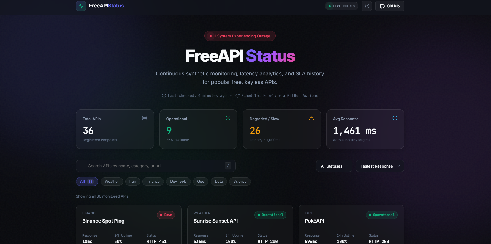
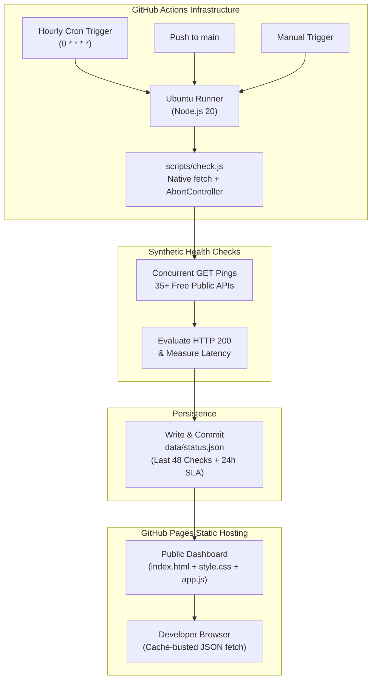

<div align="center">

  <h1>⚡ FreeAPI Status</h1>
  <p><strong>A high-performance, dark-first public status dashboard and telemetry benchmark for popular free, keyless developer APIs.</strong></p>

  <p>
    <a href="https://github.com"></a>
    <a href="LICENSE"></a>
    <a href="https://github.com"></a>
    
    
  </p>

  <p>
    <a href="https://<your-username>.github.io/<your-repo-name>/"><strong>Explore Live Dashboard »</strong></a>
    <br />
    <br />
    <a href="#-architecture">Architecture</a> •
    <a href="#-how-it-works">How It Works</a> •
    <a href="#-how-to-add-a-new-api">Add an API</a> •
    <a href="#-local-development">Run Locally</a> •
    <a href="#-roadmap">Roadmap</a>
  </p>

</div>

---

## 📸 Preview

<div align="center">
  
  <p><em>Premium glassmorphic dashboard inspired by Vercel, Linear, and Stripe. Fully responsive with zero runtime frameworks.</em></p>
</div>

---

## ✨ Features

- 💎 **Vercel / Linear / Stripe Aesthetics**: Dark-first glassmorphism with dynamic ambient mesh animations, subtle fractal noise texture, and micro-interactions.
- ⚡ **Zero Dependencies & Zero Build Step**: 100% vanilla HTML5, CSS3, and ES Modules. No webpack, vite, react, or npm packages required.
- ⏱️ **Hourly Synthetic Telemetry**: GitHub Actions runs hourly health checks on all monitored endpoints, measuring latency with `performance.now()`.
- 📈 **Interactive Latency Sparklines**: Vector SVG trend lines with area gradient fills and hover tooltips for the last 48 hourly checks.
- 🟩 **48-Hour Availability Micro-Strip**: Color-coded hourly check bars (`operational`, `degraded`, `down`) reflecting 24-hour SLA uptime.
- 🔍 **Real-time Client Search, Filters & Sorting**: Instant debounced search (`/` shortcut), category filter chips, and sorting by fastest response, slowest response, or uptime.
- 🔍 **Detailed Telemetry Modal**: Click any card or press <kbd>Enter</kbd> to inspect min, avg, and max response times with an expanded timeline chart.
- 🏷️ **Shields.io Badge Generator**: Copy real-time Markdown status badges with one click to embed in your GitHub READMEs.
- 🌓 **Persistent Theme Toggle**: Seamless light and dark mode toggle backed by `localStorage` and `prefers-color-scheme`.
- ♿ **Accessible & SEO Ready**: Targets 95+ Lighthouse scores with semantic HTML, focus rings, reduced-motion compliance, and full Open Graph / Twitter Card tags.

---

## 🏗️ Architecture



---

## ⚙️ How It Works

1. **Declarative Registry (`config/apis.json`)**:
   Target endpoints are declared with metadata, lightweight GET endpoints, and expected status codes.
2. **Synthetic Health Runner (`scripts/check.js`)**:
   Runs concurrently across all endpoints using Node 20's built-in `fetch` and `AbortController` (8s timeout).
   * **Operational**: HTTP status matches and latency is $< 1000\text{ ms}$.
   * **Degraded**: HTTP status matches but latency is $\ge 1000\text{ ms}$.
   * **Down**: HTTP error, network failure, or timeout. Automatic single-retry backoff before declaring an outage.
3. **Data Snapshots (`data/status.json`)**:
   Appends the check result to each API's rolling 48-entry history and calculates 24-hour uptime SLA percentages.
4. **Client Dashboard (`app.js`)**:
   Reads `data/status.json?t=<timestamp>`, renders animated metric counters, SVG sparklines, and dynamic category filters without querying target APIs directly from the browser (eliminating CORS and rate limits).

---

## ➕ How to Add a New API

We welcome new free, keyless APIs! Contributing takes less than 2 minutes:

1. **Fork the repository** and clone it locally.
2. Open [`config/apis.json`](config/apis.json) and add your entry:

```json
{
  "id": "my-api",
  "name": "My Free API",
  "category": "Weather",
  "url": "https://api.example.com/v1/ping",
  "expected_status": 200,
  "timeout_ms": 8000,
  "docs_url": "https://example.com/docs"
}
```

3. **Validate and test**:
```bash
node scripts/validate.js
node scripts/check.js
```

4. Submit a **Pull Request**. Our automated PR workflow will validate your JSON schema and URL security automatically.

---

## 💻 Local Development

Run the entire dashboard locally with zero external package installations:

```bash
# 1. Clone the repository
git clone https://github.com/<your-username>/freeapi-status.git
cd freeapi-status

# 2. Run the health check script to generate status data
node scripts/check.js

# 3. Serve the static site locally
# Using Python:
python -m http.server 8080

# Or using Node.js:
npx serve .
```

Open [http://localhost:8080](http://localhost:8080) in your browser.

---

## 🗺️ Roadmap

- [x] Expanded catalog monitoring 35+ popular free APIs across 7 categories
- [x] Hourly automated check batch via GitHub Actions
- [x] 48-check historical timeline and 24h rolling uptime rollup
- [x] Detail modal with min/avg/max telemetry charts and Shields.io badge generator
- [x] Pull request schema validator workflow
- [ ] Multi-region synthetic check pings (US, EU, APAC)
- [ ] Incident notification webhooks (Discord / Slack / Telegram)
- [ ] Automated RSS/Atom incident feed (`feed.xml`)
- [ ] API comparison view (compare latency between similar providers)

---

## 📄 License

This project is licensed under the [MIT License](LICENSE) — Copyright © 2026 FreeAPI Status Contributors.
